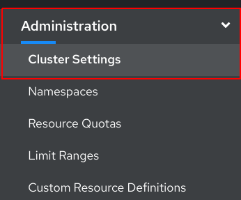
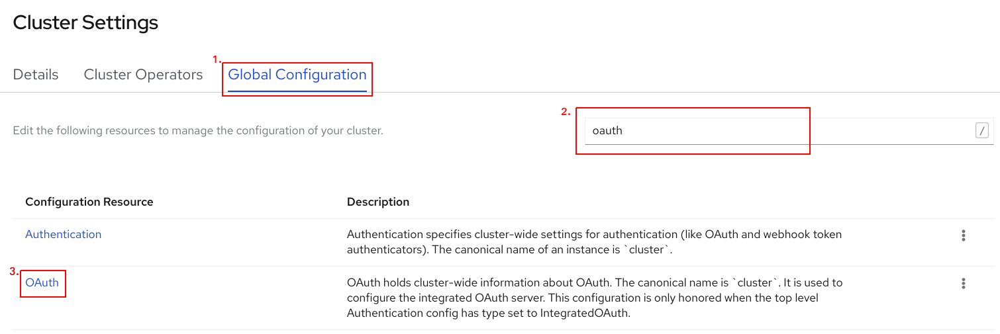
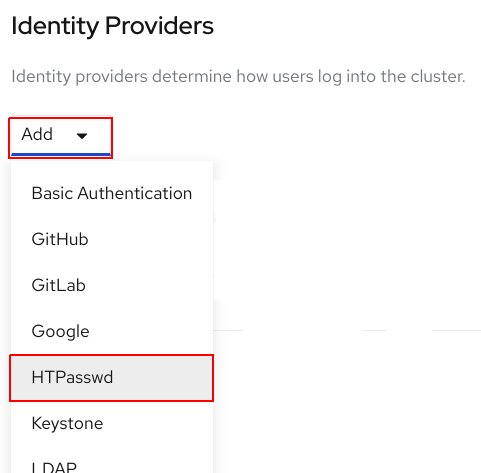

## Create User

Create htpasswd file

`htpasswd -c -B -b users.htpasswd developer 'developer'`{{execute}}

## Upload htpasswd file

**Access Openshift Console** 

As cluster admin navigate to __Cluster Settings__.

`Administration -> Cluster Settings`

**Manage OAuth Configurations**

From __Cluster Settings__
* Select the __Global Configuration__ tab
* Search for __oauth__
* Click the __OAuth__ link   

**Add Identity Provider**

* Scroll to the bottom of the oAuth page
* Click __Add__ under __Identity Providers__
* Selecct HTPasswd

