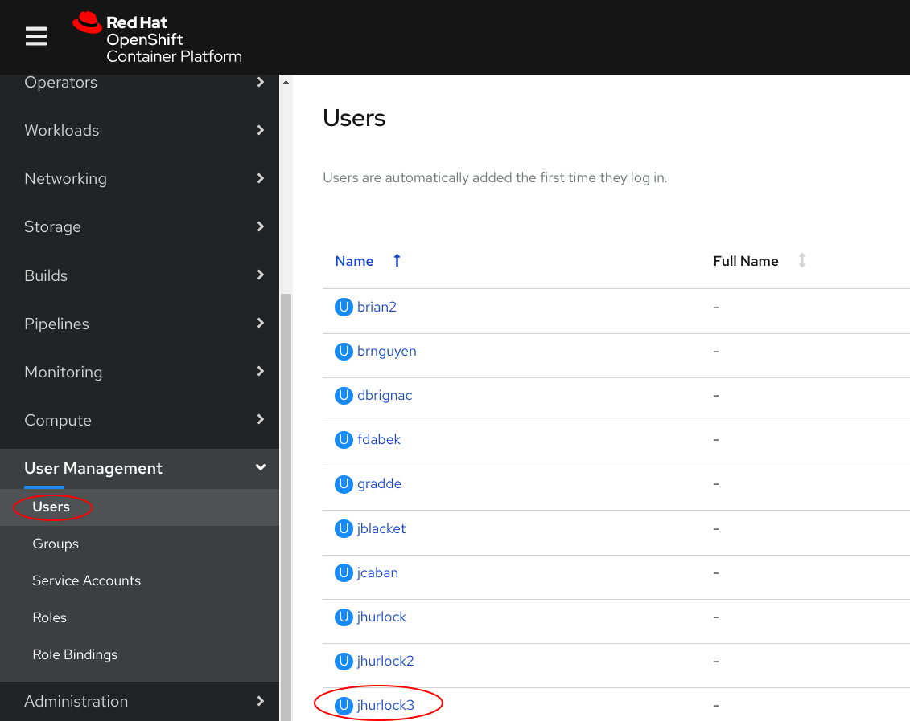
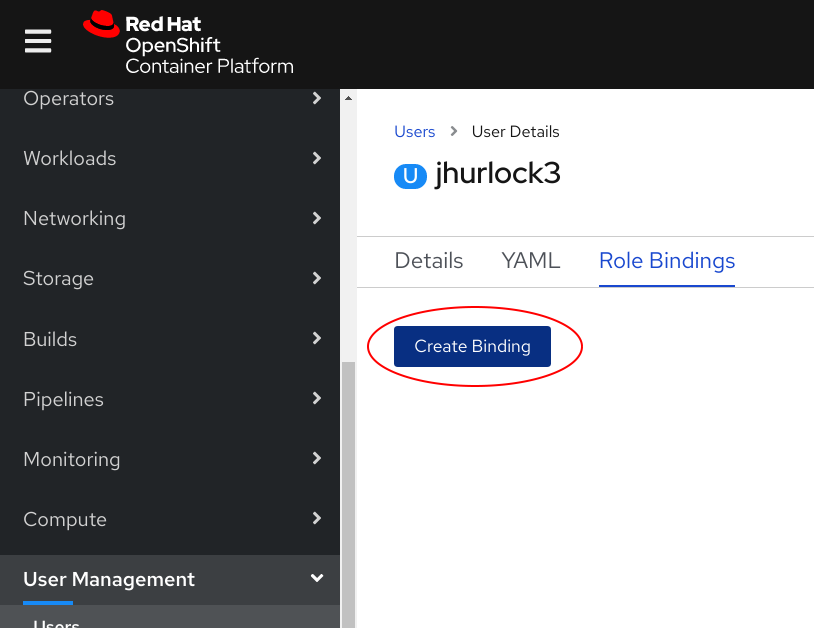
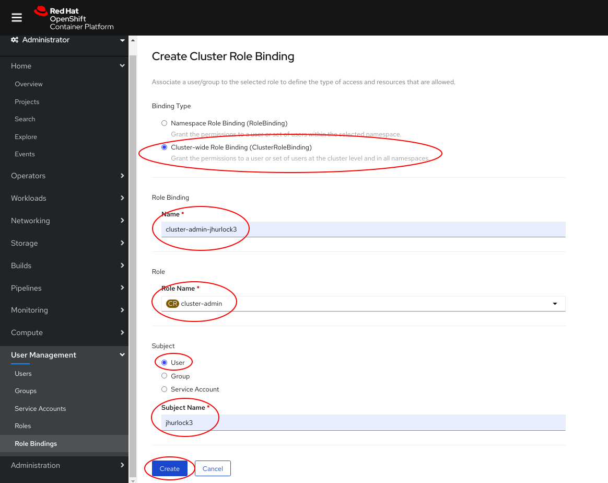

## Add Cluster Admin Rights

In this scenario we are going to grant cluster admin access to the user __jhurlock3__ by adding the cluster admin role binding to the user account.

**Select User**

From the __Users__ page select user __jhurlock3__

* As an administrative user expand __User_Management__

* Click on the user __jhurlock3__ to add cluster admin rights

** Create Binding**

From the __User Details__ page create the Role Binding.

* Click on __Create Binding__

**Create Cluster Role Binding**

Fill out the  information to create the cluster role binding. 

* Select __Cluster-wide Role Binding__

* Give the Role Binding a unique name, __cluster-admin-jhurlock3__

* Select __cluster-admin__ as the Role Name

* Select __User__ as the Subject

* Enter the user name, __jhurlock3__ as the Subject Name

* Click __Create__

**Verify Cluster Admin Access**

Log out and then log back in as the user, __jhurlock3__. You should see all of the projects in the cluster.
