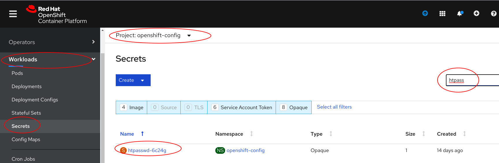
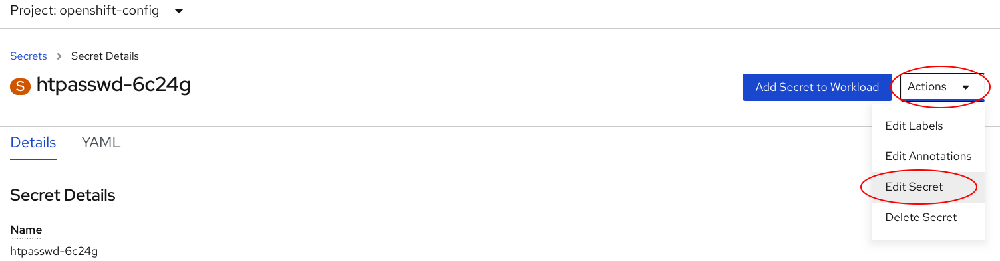

## Add Existing User

Add a user to an existing htpasswd file.

**Display HTPasswd Secret**

Logged in as an administrative user to display the HTPasswd secret used to login to the Openshift console. 

* Expand Workloads

* Click on __Secrets__
 
* Select the __openshift-config__ project

* Search for __'htpass'__. 

* Click on the secret __htpasswd-6c24g__

**Select Secret Details**

* Select the __Actions__ drop down

* Click on __Edit Secret__.

**Edit Secret Details**

Update the value of the user, __jhurlock3__, for the key __htpasswd__.
 
* Add username and password for the user, __jhurlock3__

* Click __Save__

