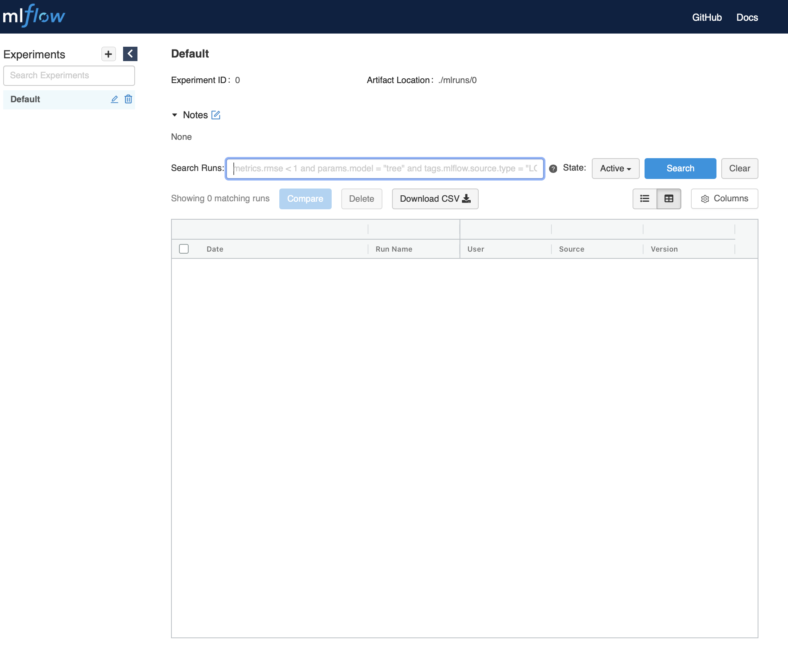

## Creating your own Project

Create a new project called __mlflow-sandbox__

`oc new-project mlflow-sandbox`{{execute}}

```bash
You can add applications to this project with the 'new-app' command. For example, try:

    oc new-app ruby~https://github.com/sclorg/ruby-ex.git

to build a new example application in Python. Or use kubectl to deploy a simple Kubernetes application:

    kubectl create deployment hello-node --image=gcr.io/hello-minikube-zero-install/hello-node
```

## Install MLflow

**Add Helm Repository**

`helm repo add larribas https://larribas.me/helm-charts`{{execute}}

```bash
"larribas" has been added to your repositories
```

**Install MLflow Operator**

`helm install mlflow-sandbox larribas/mlflow --version 1.0.1`{{execute}}

```bash
    NAME: mlflow-sandbox
    LAST DEPLOYED: Thu Sep 17 05:54:35 2020
    NAMESPACE: mlflow-sandbox
    STATUS: deployed
    REVISION: 1
    NOTES:
    1. Get the application URL by running these commands:
    export NODE_PORT=$(kubectl get --namespace mlflow-sandbox -o jsonpath="{.spec.ports[0].nodePort}" services mlflow-sandbox)
    export NODE_IP=$(kubectl get nodes --namespace mlflow-sandbox -o jsonpath="{.items[0].status.addresses[0].address}")
    echo http://$NODE_IP:$NODE_PORT
```

**Grant Security Context Constraints**

`oc adm policy add-scc-to-user anyuid -z mlflow-sandbox`{{execute}}

```bash
securitycontextconstraints.security.openshift.io/anyuid added to: ["system:serviceaccount:mlflow-sandbox:mlflow-sanbox"]
```

__CAUTION__, `anyuid` provides all features of the restricted SCC this will be the equivalent as allowing UID 0, or root user, both inside and outside the container.

**MLflow Service Account**

`oc set serviceaccount deployment mlflow-sandbox mlflow-sandbox`{{execute}}

```bash
deployment.apps/mlflow-sandbox serviceaccount updated
```

**Expose MLflow Route**

`oc expose svc/mlflow-sandbox`{{execute}}

```bash
route.route.openshift.io/mlflow-sandbox exposed
```

**Verify MLflow Route**

`oc get route`{{execute}}

To view MLflow interface go to the displayed URL.


